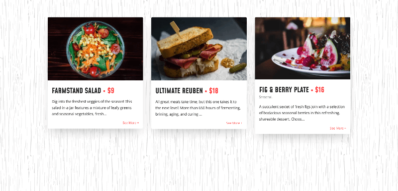

# Codepen Challenge - Card Text

This pen is part of the Codepen challenge 'Card Text'.

You can see the challenge [here](https://codepen.io/challenges/2021/november/2).

## Table of contents

-   [Overview](#overview)
    -   [The challenge](#the-challenge)
    -   [Screenshot](#screenshot)
    -   [Links](#links)
-   [My process](#my-process)
    -   [Built with](#built-with)
    -   [What I learned](#what-i-learned)
    -   [Useful resources](#useful-resources)
-   [Author](#author)
-   [Acknowledgments](#acknowledgments)

## Overview

### The challenge

During this challenge, we had to focus on communicating through typeface, color, size, etc. We had to transform a basic layout into showy content making changes in typography.

As an extra challenge, we also had to make the text within the cards into truncated text.

### Screenshot



### Links

-   [Codepen](https://codepen.io/Javieer57/full/bGrjvJB)

## My process

### Built with

-   Semantic HTML5 markup
-   CSS custom properties
-   Flexbox
-   Mobile-first workflow
-   Vanilla Javascript
-   [SASS](https://sass-lang.com/) - CSS preprocessor
-   [Normalize](https://reactjs.orghttps://necolas.github.io/normalize.css/)
-   [Google Fonts](https://fonts.google.com/)

### What I learned

During the challenge, I had an issue with how to truncate text.

I read the sources that Codepen provided and tried to apply them to my code but, it didn't work how I expected.

I thought that [Shave](https://dollarshaveclub.github.io/shave/) plugin will work but, it erase the HTML elements within the cards and I didn't find the way to make it work in reverse (truncated to full text).

So I had to apply a simple JS function to truncate the text and it was easier.

I put here the function so anyone can use it:

```javascript
/**
 * Truncate a string
 * @param {string} text - text you want to be truncate
 * @param {number} letters - number of letters in the truncated text
 * @returns {string} - returns an truncated text within an <p> element to be insert as HTML
 */
function truncateText(text, letters = 130) {
	let truncatedText = text.slice(0, letters);
	let truncatedToHTML = `<p class="truncate">${truncatedText}...</p>`;

	return truncatedToHTML;
}
```

### Useful resources

-   [Truncate a String - Basic Algorithm Scripting - Free Code Camp](https://youtu.be/cgBJQJzMkGw) - This video taught me how to truncate text with JS and gave me the idea of how to insert the truncated text within the cards.

## Author

-   Frontend Mentor - [@Javieer57](https://www.frontendmentor.io/profile/Javieer57)
-   Github - [@Javieer57](https://github.com/Javieer57)
-   Codepen - [@Javieer57](https://codepen.io/Javieer57)
-   Instagram - [@javieer_eufracio](https://www.instagram.com/javieer_eufracio/)

## Acknowledgments

I'm not the best at design. So I had to look at the work of designers from [Behance](Behance.com) to take inspiration. Thank you so much to all the designers who share their work. It's so helpful.
